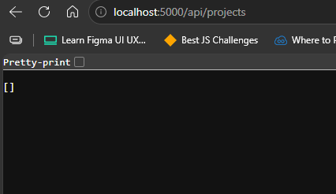
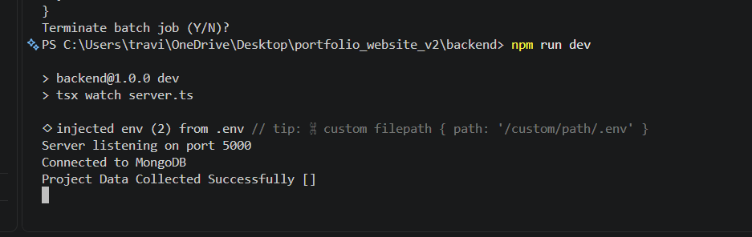
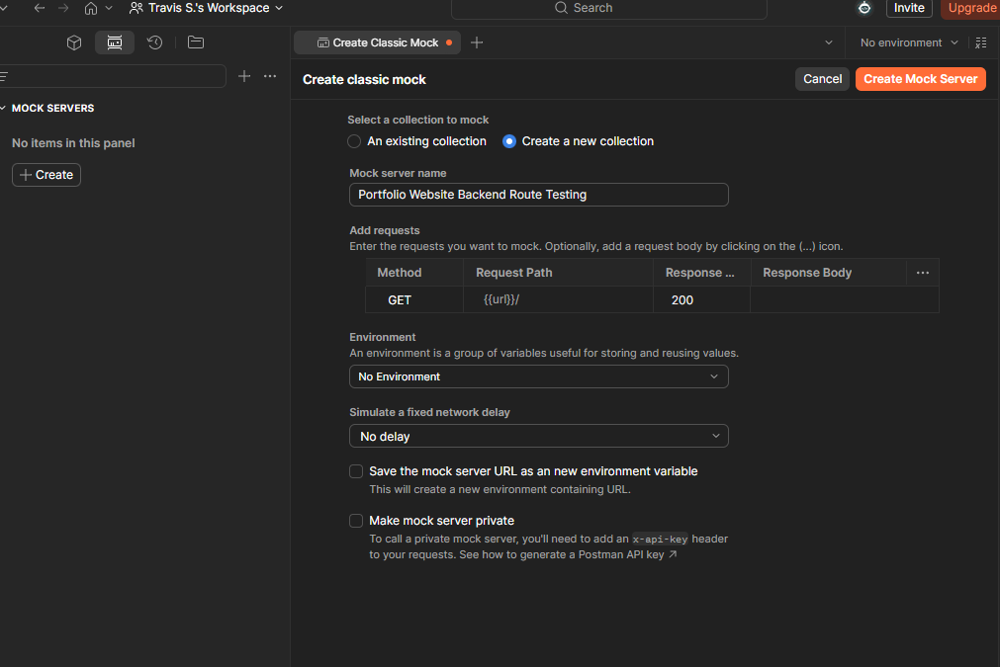
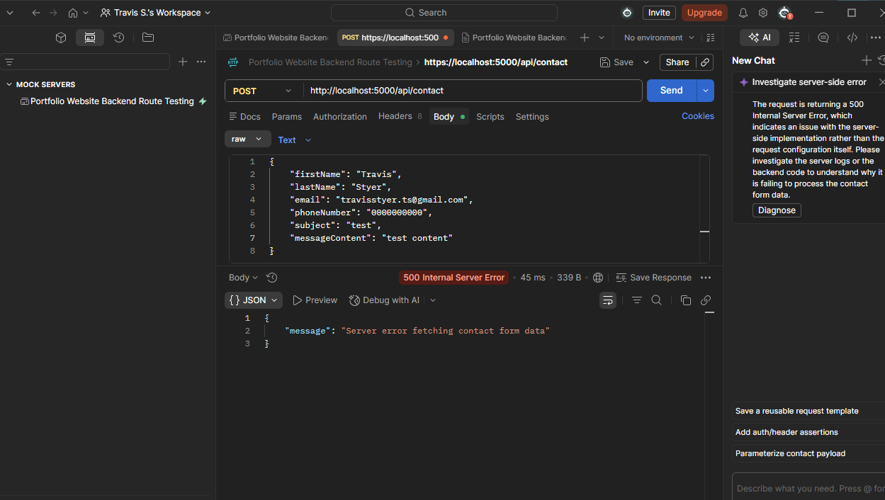
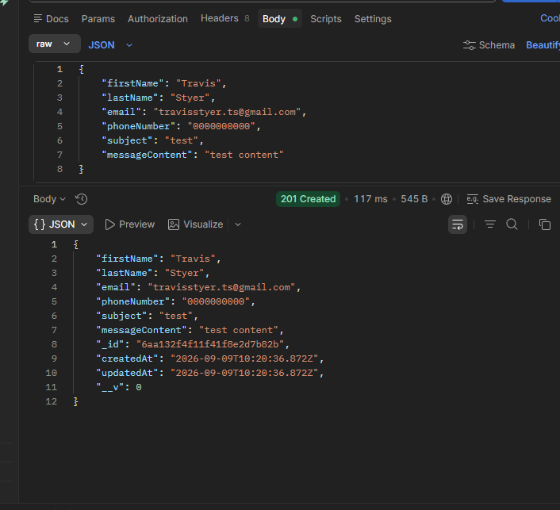
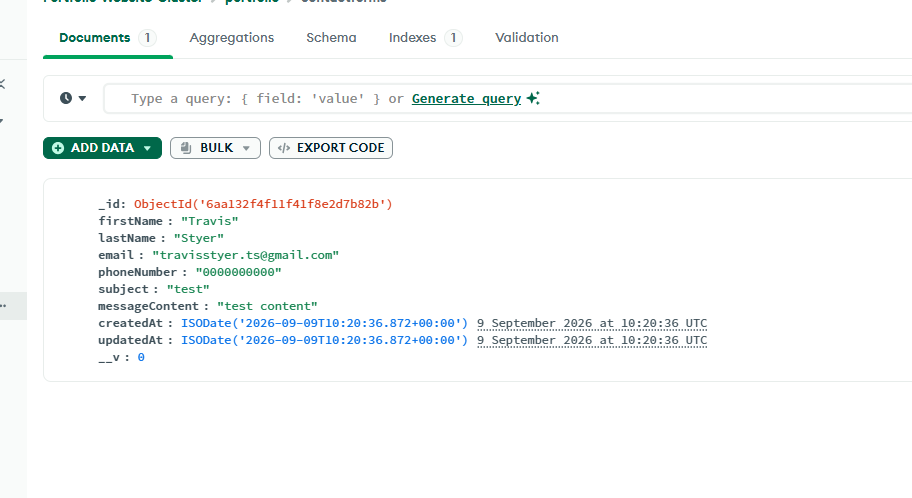

# Portfolio-Site-V2

---

## Error Handling

### Centralised Error Handling

I created a main error handler which runs after each route is called in the server. This is so app.listen can only run once the request passes the error handler.

It is set up to be vague so that those sending requests cannot see any potentially important information in the error message. 

---

## Testing

### Manual Testing

**Backend Routing**

1. Verifying the successfull connection of the Project Route

After creating the mode, controller, router, and implementing it onto server.ts, I then ran the backend with npm run dev. 
To see the successfull connection of the specific url, I appended the address with "/api/projects", and an empty array was show, 
which signals successful rendering of the url:

You can also see a successful render in the console:

#### Post Man

I used Postman to test the backend routes functioned properly before allowing requests to be sent to it from the client/frontend. 

I first created a collection dedicated to this project:

**POSTMAN Contact Form Route Testing**

I then sent a post request to my contact form model and got the error message I created:

This is a specific message I wrote in the controller, so the request passed the first, central middleware, but couldn't pass my controller. 

In the terminal, there was a connection error to MongoDB, so I had to resolve that in my MongoDB cluster, first. What I needed to do was add an ip address of 0.0.0.0/0 so that all access was allowed as my IP would change. 

After fixing the IP address, I sent it successfully:

MongoDB Updated:

**Testing Endpoints with Postman**

With the server running (`npm run dev`), each endpoint was tested individually in Postman before moving on to the next.

- `GET /api/projects` and `GET /api/blogs` - sent with no body. Expected an empty `[]` array with a `200` status, since no data has been seeded yet. This confirms the route/controller/model chain works even with an empty database.

- `POST /api/contact` - tested in stages to confirm the validation middleware actually works, not just the happy path:
  1. A fully valid JSON body (all required fields present, valid email) -> expected `201` with the saved document returned, including a generated `_id` and `createdAt`.
  2. A body missing a required field -> expected `400` with the "missing required field" message.
  3. A body with an invalid email format -> expected `400` with the "invalid email format" message.
  4. A valid body sent again afterwards, to confirm the endpoint wasn't just rejecting everything.
  5. Checked MongoDB Atlas's Data Explorer after a successful `201` to confirm the message was actually saved, not just reported as successful by the API.

- **Centralized error handler** - verified separately by deliberately breaking something the per-route `try`/`catch` blocks wouldn't catch (temporarily using an invalid `MONGODB_URI` in `.env`), then hitting an endpoint. Expected a generic `{"message": "Something went wrong"}` response at `500`, with no stack trace or internal details exposed.