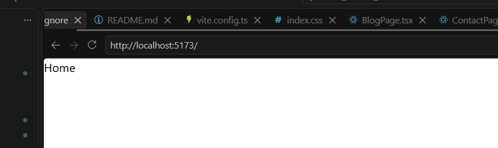
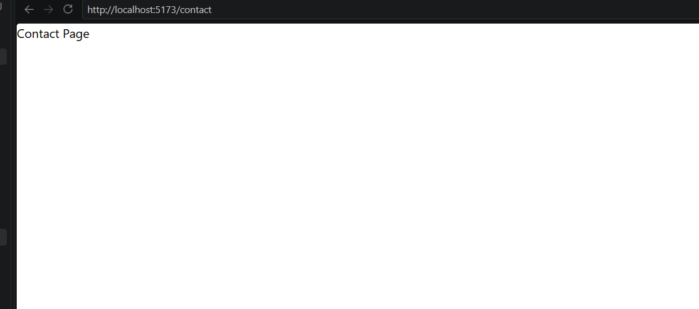
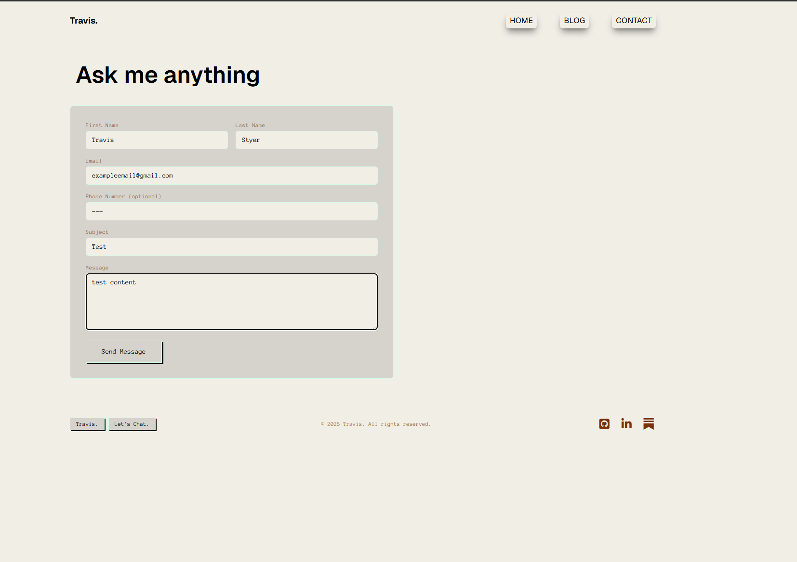
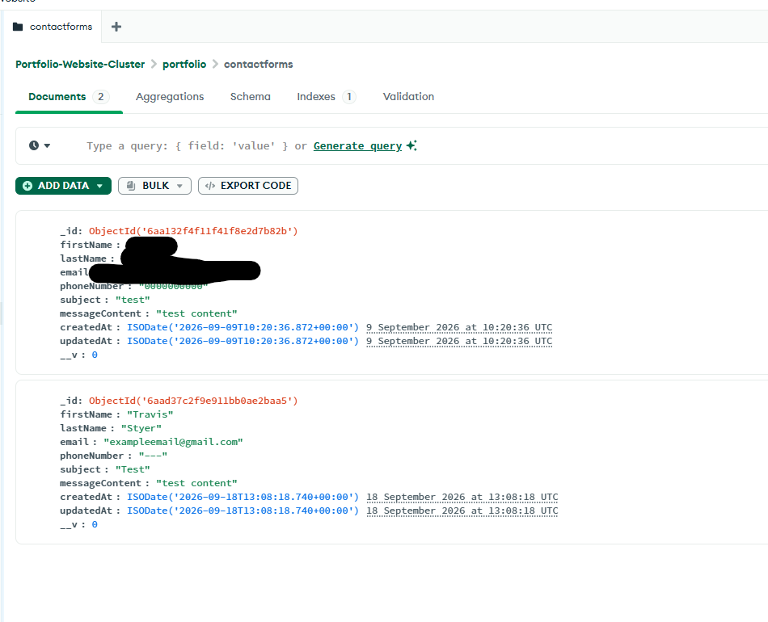
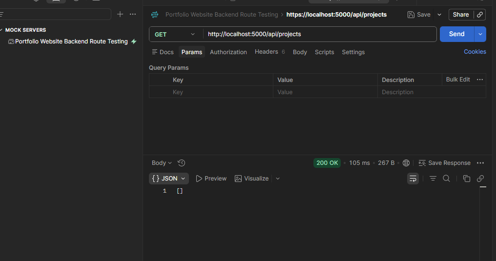
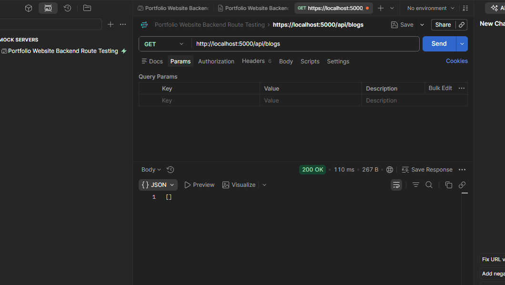
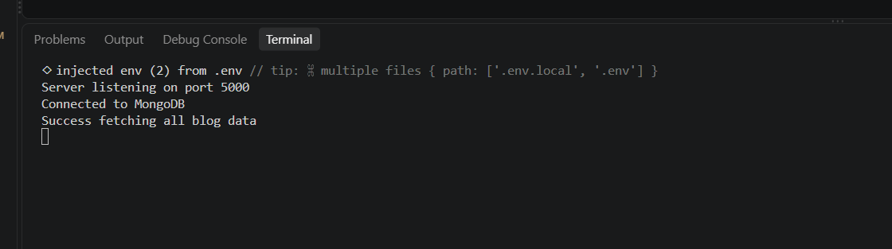
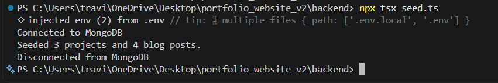
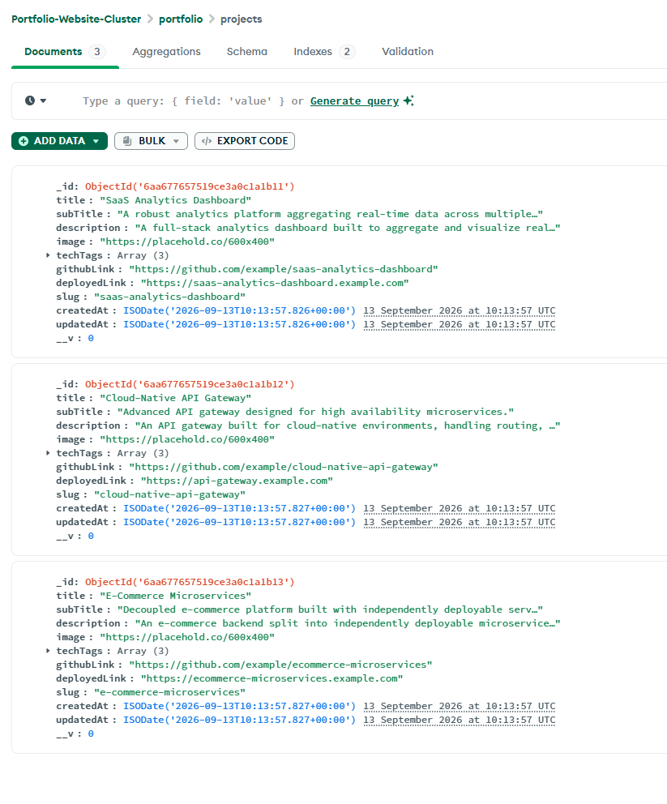
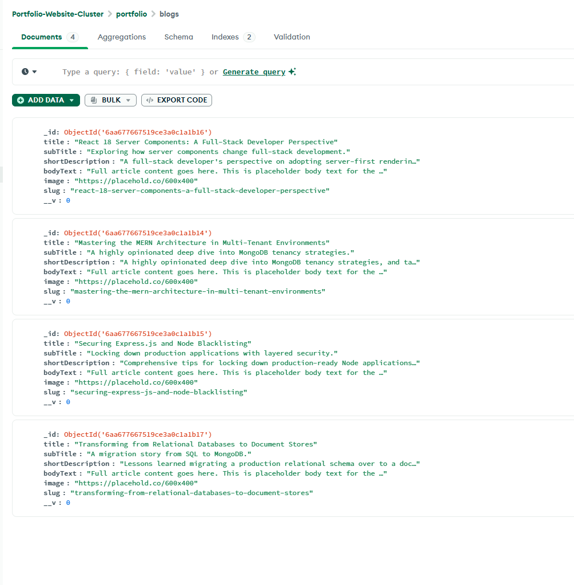

# Portfolio-Site-V2

---

## Error Handling

### Centralised Error Handling

I created a main error handler which runs after each route is called in the server. This is so app.listen can only run once the request passes the error handler.

It is set up to be vague so that those sending requests cannot see any potentially important information in the error message. 

---

## Contact Form

### How the form's state works

**useState** is what keeps track of everything currently typed into the form, and what stage the submission is in. There are two separate pieces of state:

- One object holding the current value of every field (first name, last name, email, phone, subject, message) - this starts out empty and updates as the user types.
- A single status value (`idle`, `submitting`, `success`, or `error`) - this controls what the submit button says and whether a success or error message shows underneath it.

**ChangeEvent** fires every single time the user types (or deletes) a character in any input or the message box. Rather than writing a separate function for each of the six fields, there's one shared handler that looks at *which* input fired the event (via its `name` attribute) and updates just that one field in the state object, leaving the others untouched.

**SubmitEvent** fires once, when the "Send Message" button is clicked. Normally, submitting an HTML form makes the browser reload the whole page - the first thing this handler does is cancel that default behaviour, so the page stays exactly as it is. It then sends the current form state to the backend (`POST /api/contact`) as JSON, and updates the status based on whether that request succeeded or failed, which is what triggers the success/error message to appear.

---

## Managing Site Content (Blogs & Projects)

### Where the content actually lives

The blogs and projects shown on the site are stored in **MongoDB**, not in files. The files under `backend/data/` are the *source of truth in git* - the seed script reads them and pushes their contents into the database.

```
backend/
  data/
    blogs.ts      <- the list of blog posts (edit this to publish)
    projects.ts   <- the list of projects
  seed.ts         <- the loader that pushes ./data into MongoDB
```

Data and logic are kept apart on purpose: `data/` holds content I change often, and `seed.ts` holds loading logic I rarely touch.

### Blog posts don't store article text

Blog articles are written and hosted on **Substack**, so the database never stores the article body. Each blog record is just the card shown on the site plus a `substackLink` out to the full post, which the card's "VIEW BLOG" link uses.

This also avoids splitting search-engine ranking signals across two copies of the same article - Substack keeps the canonical version.

### Publishing a new blog post

1. Add an object to the `blogs` array in `backend/data/blogs.ts`, including a hand-written `slug`.
2. Run the seed script:
   ```bash
   cd backend
   npm run seed
   ```
3. Commit the change - the content is version-controlled and reviewable in git alongside the code.

Adding a project works the same way, via `backend/data/projects.ts`.

### Why the script updates instead of wiping

The first version of `seed.ts` called `deleteMany({})` and recreated everything on every run. That was fine for placeholder data, but it had two problems once the content became real:

- Pointing `MONGODB_URI` at the live database and running the script would **delete all real content** before rewriting it.
- Every document got a brand-new `_id` on each run, so nothing could reliably reference a blog or project.

The script now **upserts** each record instead, matching on `slug`:

```ts
await model.findOneAndUpdate(
    { slug: item.slug },
    { $set: item },
    { upsert: true, new: true, runValidators: true, setDefaultsOnInsert: true }
);
```

If a record with that slug exists it's updated in place; if it doesn't, it's inserted. Adding one new blog post therefore inserts only that post and leaves everything else untouched, and the script is safe to run repeatedly.

The original wipe-and-rebuild behaviour is still available behind an explicit flag, for resetting a local database:

```bash
npm run seed -- --fresh
```

**Only use `--fresh` against a local/development database.** Against the live one it deletes the real content first.

### Why slugs are written by hand

Both models have a `pre("validate")` hook that generates a slug from the title. That hook is *document* middleware, but `findOneAndUpdate` is *query* middleware - so the hook **does not run during an upsert** and slugs are never auto-generated there.

Writing the slug by hand in `data/` is also safer than deriving it from the title. An auto-derived slug changes whenever the title is reworded, which would make the upsert match nothing and silently insert a **duplicate** record instead of updating the original. A hand-written slug is a stable identity that survives title edits.

---

## Testing

### Manual Testing

**Backend Routing**

1. Verifying the successfull connection of the Project Route

After creating the mode, controller, router, and implementing it onto server.ts, I then ran the backend with npm run dev. 
To see the successfull connection of the specific url, I appended the address with "/api/projects", and an empty array was show, 
which signals successful rendering of the url:


You can also see a successful render in the console:


**Frontend Routing**

After wiring up React Router in `App.tsx` (Home, Blog, and Contact routes), I ran the frontend with `npm run dev` and manually visited each route in the browser to confirm the correct page component rendered at the correct URL.

Home page at `/`:



Contact page at `/contact`:




**Contact Form Testing**

Filled out the contact form in the browser and submitted it:



Confirmed in MongoDB Atlas's Data Explorer that the submission was actually saved, matching what was typed into the form:




#### Post Man

I used Postman to test the backend routes functioned properly before allowing requests to be sent to it from the client/frontend. 

I first created a collection dedicated to this project:


**POSTMAN Contact Form Route Testing**

I then sent a post request to my contact form model and got the error message I created:


This is a specific message I wrote in the controller, so the request passed the first, central middleware, but couldn't pass my controller. 

In the terminal, there was a connection error to MongoDB, so I had to resolve that in my MongoDB cluster, first. What I needed to do was add an ip address of 0.0.0.0/0 so that all access was allowed as my IP would change. 


After fixing the IP address, I sent it successfully:


MongoDB Updated:


**POSTMAN Project Route Testing**

I had the same success fetching the projects on the first postman test:




**POSTMAN Blog Get Request Testing**

The following postman request was a simple get request and the success was a terminal log and empty array show below:






**Testing Endpoints with Postman**

With the server running (`npm run dev`), each endpoint was tested individually in Postman before moving on to the next.

- `GET /api/projects` and `GET /api/blogs` - sent with no body. Expected an empty `[]` array with a `200` status, since no data has been seeded yet. This confirms the route/controller/model chain works even with an empty database.

- `POST /api/contact` - tested in stages to confirm the validation middleware actually works, not just the happy path:
  1. A fully valid JSON body (all required fields present, valid email) -> expected `201` with the saved document returned, including a generated `_id` and `createdAt`.
  2. A body missing a required field -> expected `400` with the "missing required field" message.
  3. A body with an invalid email format -> expected `400` with the "invalid email format" message.
  4. A valid body sent again afterwards, to confirm the endpoint wasn't just rejecting everything.
  5. Checked MongoDB Atlas's Data Explorer after a successful `201` to confirm the message was actually saved, not just reported as successful by the API.

- **Centralized error handler** - verified separately by deliberately breaking something the per-route `try`/`catch` blocks wouldn't catch (temporarily using an invalid `MONGODB_URI` in `.env`), then hitting an endpoint. Expected a generic `{"message": "Something went wrong"}` response at `500`, with no stack trace or internal details exposed.


### Creating Seed Data

The GET routes for projects and blogs only ever returned empty arrays, since no real content existed yet. To have realistic data to build and test the frontend against, I wrote a `seed.ts` script that connects to the database directly, clears out any existing projects/blogs, and inserts a set of sample documents.

> **Note:** `seed.ts` has since been reworked. It no longer wipes the collections by default - it now reads from `backend/data/` and upserts each record on its `slug`. See [Managing Site Content](#managing-site-content-blogs--projects) above.

Running the script successfully in the terminal:



The 3 seeded projects, visible in MongoDB Atlas's Data Explorer:



The 4 seeded blog posts, visible in MongoDB Atlas's Data Explorer:


